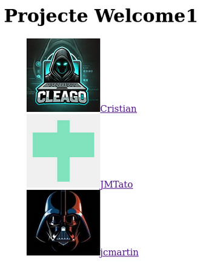

## Copiado del repositorio

Para empezar a hacer el repositorio, copiaremos el repositorio del profesor en nuestro Kali linux, pero necesitamos cambiar el nombre, por lo que tenemos que utilizar el siguiente comando:

~~~
https://github.com/jmmedinac03/PPS-Unidad0Actividad3-JoseMi.git PPS-Actividad5Unidad0-JulioManuelTatoPulido
~~~

Entramos a la carpeta con el comando ``cd PPS-Actividad5Unidad0-JulioManuelTatoPulido`` y eliminamos la conexión con el repositorio original con el siguiente comando:

~~~
git remote remove origin
~~~

A continuación, tenemos que agregar el nuevo repositorio como remote, sustituyendo al antiguo, con el siguiente comando:

~~~
git remote add origin git@github.com:jmtatop01/PPS-Actividad5Unidad0-JulioManuelTatoPulido
~~~

Finalmente para tener el repositorio totalmente copiado en nuestro Kali y en nuestro Github, lo subiremos, con el comando:

~~~
git push -u origin main
~~~

## Configuración del repositorio

Ahora, modificaremos el repositorio empezando por que tenemos que borra su imagen de la carpeta “img”, borrar las imágenes de la carpeta “imágenes” con el comando ``rm`` y de la carpeta “profile” modificar el “.html” de nuestro profesor, para que aparezca nuestro nombre y nuestra información que queramos dar, con el comando ``nano``.

Una vez hecho eso, nos descargamos una imagen de perfil de nuestro GitHub, que guardaremos en la carpeta “img”, poniendo el mismo nombre que a nuestro “.html”.
Cuando lo hayamos configurado, ejecutaremos el comando ``php -S 0:8080`` para que se pueda visualizar en nuestro navegador.

Una vez que nos encontramos en esa página, si pulsamos en el nombre, podemos irnos a nuestro “.html” que hemos modificado anteriormente.

##  Colaboración con compañeros

Una vez realizada la  configuración anterior, nos fijamos en la participación entre los compañeros de clase, en este caso tenemos que compartir nuestro repositorio con nuestros compañeros.

Una vez invitado a nuestros compañeros, tienen que crear ramas en mi repositorio para que aparezcan sus imágenes y sus “.html” y poder así simular un trabajo colaborativo.

##  Colaboración con un compañero

Voy a realizar una documentación solo de un compañero, ya que el proceso es el mismo en los demás repositorios. Para empezar me he clonado el repositorio de mi compañero Juan Carlos:

Una vez en el repositorio de mi compañero me he creado una rama llamada “Vers-jmtato” con el comando ``git branch Vers-jmtato``.

Me he metido en la rama que he creado con el comando ``git checkout Vers-jmtato``.

Y desde ahí incluyendo en la carpeta “img” mi foto de perfil llamándose igual que el “.html”.

Después, ejecuto el comando ``php -S 0:8080``, para poder visualizarlo desde la página, introduciendo la dirección en el navegador:

Y si nos metemos en el enlace de mi perfil, nos redireccionará a mi “.html” con la información aportada, que también he introducido en la carpeta “profile”.

Luego, para que se guardase en el repositorio remoto de mi compañero he seguido los siguientes comandos:

A continuación, me he metido en el repositorio remoto de mi compañero para comprobar que he subido correctamente los cambios realizados:

Después he copiado lo mismo que he añadido en mi rama, a la rama principal, para que también se pueda ver desde ahí, siguiendo también los mismos comandos que he hecho en mi rama.

## Comprobación de mi repositorio

Quedando así la colocación de la rama main de mi repositorio remoto después de los cambios de mis compañeros en él.

Y también como ha quedado la página web de los perfiles:

